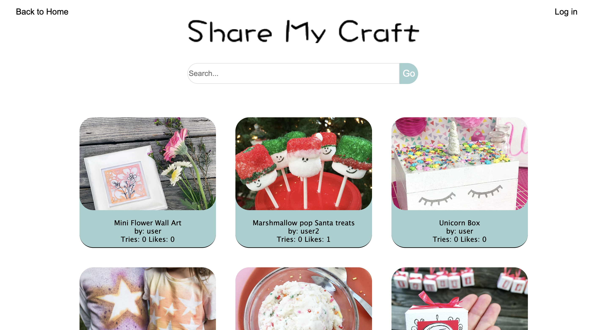
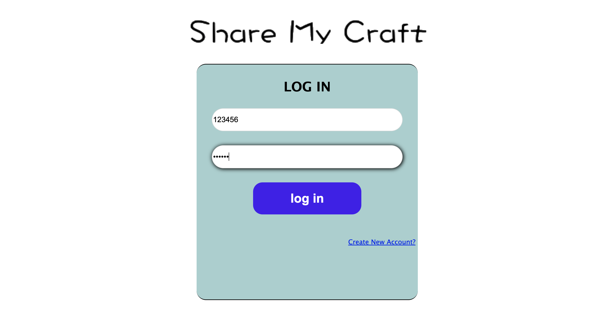
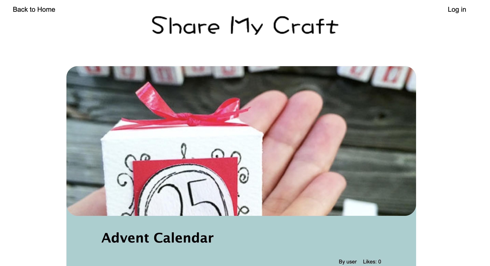
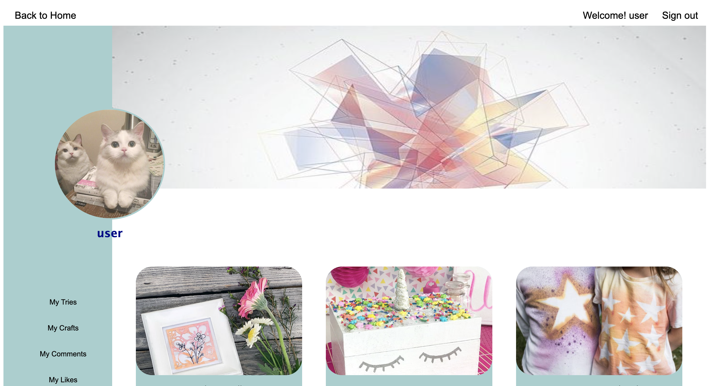
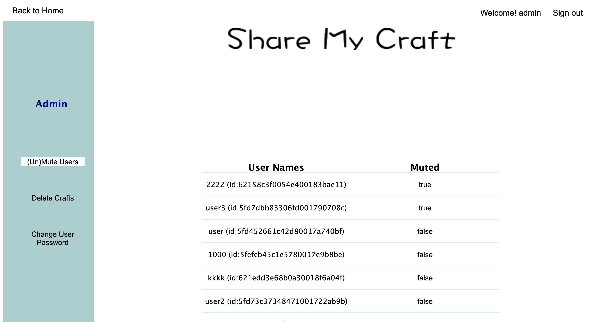

# team09: Share My Craft
## Installing and running locally
    Important: Please do not refresh on the main page for many time, we have a very limited cloudinary quota
1. clone git repo:
    ```
    git clone https://github.com/HuanzhangXia/CSC309-team-project.git
    ```
2. go to project top level directory:
    ```
    cd CSC309-team-project/share_my_craft/api
    ```
3. Install npm dependencies
    ```
    npm install 
    ```
4. Start the server
    ```
    node app.js
    ```
5. The app should be available at ```localhost:3000```, have fun. If an error```listen EADDRINUSE: address already in use :::5000``` occurred, change to another port (ex: 5000) on line 46 of ```app.js``` and try again.

## Viewing the deployed app on Heroku
The app is deployed via Heroku, and it is available at https://sharemycraft-a8121e9bede8.herokuapp.com/index.

# Overview of functionalities
## Index
1. This is the entry-point for any user.
2. If the user does not log in, the button on the top right corner would have the text 'Login'. The user can open the login page by clicking on the button.
3. A user can click on tags of the crafts to open the corresponding craft page.
4. A user can search for crafts by crafts' titles and authors. This can be done by typing in a keyword in the search bar and click on the 'Go' button or hit the Enter button on key board.


## Login/signup
1. If the user has an account, he/she can log in by typing the correct username and password and clicking on the login button. The user will get a red alert if he/she submit incorrect information. Once logged in, it will open the index page with a welcoming text on top-right.(If you prefer not to register as a new user, you can attempt to log in using this account: username: user, password: user)
2. If the common user has logged in, it will open the index page. The button on the top right corner on the index page would have a welcoming text. The user can open the personal page by clicking on the button. If the admin has logged in, it will open the admin page.
2. If the user wants to sign up for an account, he/she can click on the link at the bottom right corner of the box. It will open the signup page.
3. The user can sign up on the signup page. He/she can choose usernames that have not been taken. He/she cannot select 'admin' as the username. It will open the index page once signed up.

## Craft
1. The craft page is an important feature of the website. A single craft page loads information about a hard-coded craft. The webpage displays the title, author, and all instructions of the craft. At the end of the instructions, there is a comment block for users to add comments. After the comment block, there is a try block for users to show their products.
2. The user can view the personal page of the craft's author by clicking on the username below the title. The personal page showed to the viewer does not contain the setting buttons.
3. The user can also like the craft by clicking on the like button below the title. A user can only like the same craft once.

## Personal
1. The user can view the crafts he/she has tried, the crafts he/she added, the crafts he/she commented, or liked on the personal page by clicking buttons on the sidebar.
2. The user can add a new craft on the personal page. 
3. The user can change its profile picture, banner picture, and password on the personal page. 

## Admin
1. The admin can mute common users or crafts in the admin page. The admin does not have its personal picture or banner picture. Our website has only one admin.

## Database
We use MongoDB to manage our databases.

# Overview of routes
## User API

- ```GET /users```

    - Get a list of users (for admin only)
    - **Input:** cookie: ```userId```
    - **Output:** a list of users (in json)
    
- ```POST /users```

    - For Sign up: add a new user
    - **Input:** body(json): ```username```, ```password```, ```userType```( ```user``` / ```admin```). Other specific information are not required.
    - **Output:** a new user (json)

- ```POST /users/login```

    - For user to login 
    - **Input:** body(json): ```username```, ```password```
    - **Output:** If authenticated with correct ```username``` and ```password``` then return a user (json), else, reject.
    
- ```GET /users/current```

    - Get the current user.
    - **Input:** cookie: ```userId```
    - **Output:** a user (json)
    
- ```PUT /users/:userId```

    - For admin to mute/unmute a user.
    - **Input:** cookie: ```userId```. path parameter: ```userId```. request body: ```mute```
    - **Output:** the user
    
- ```PUT /users/password/:userId```

    - For user/admin to change the user's password
    - **Input:** cookie: ```userId```. path parameter: ```userId```. body(json): ```password```
    - **Output:** the user with his/her password changed
    
- ```PUT /users/profilePic/:userId```

    - For user to change his/her profile picture
    - **Input:** cookie: ```userId```. path parameter: ```userId```. body(URL in json): ```profilePic```
    - **Output:** the user with new profile picture
    
- ```PUT /users/bannerPic/:userId```

    - For user to change his/her banner picture
    - **Input:** cookie: ```userId```. path parameter: ```userId```. body(URL in json): ```bannerPic```
    - **Output:** the user with new banner picture
    

## Craft API

- ```GET /crafts/allcrafts```
    - Get all crafts (the tries and comments not loaded)
    - **Output:** a list of crafts
    
- ```GET /crafts/:craft_id```

    - Get a craft by id with deatails of tries and comments loaded.
    - **Input:** path parameter: ```craft_id```
    - **Output:** the craft with ```craft_id```

- ```PATCH /crafts/:craft_id```

    - For user to like the craft
    - **Input:** path parameter: ```craft_id```, cookie: ```userId``` 
    - **Output:** the updated craft (wraped in json)

- ```DELETE /crafts/:craft_id```

    - Delete a craft and all its comments, tries and likes. Delete the corresponding likes, comments and tries stored in the users who liked, commented or tried the craft.
    - **Input:** path parameter: ```craft_id```
    - **Output:** the deleted craft

- ```POST /crafts/addCraft```

    - Add a new craft
    - **Input:** cookie: ```userId```. body(json): an object with informations about the craft: {```coverName```,```title```,```author```,```intro```,```supplies```,```tips```,```stepPics```,```steps```,```totalSteps```}
    - **Output:** a new craft object and its author


- ```POST /crafts/addComment```

    - Add a new comment
    - **Input:** an object with informations about the craft:{```comMsg```,```comCraft```,```author```}
    - **Output:** a new comment object, its author and the commented craft

- ```GET /crafts/detailsbyUser/:user_id```
    - Get details of the comments, tries and crafts created by the user.
    -**Input** pathe parameter: ```user_id```
    - **Output:** A json object with details about the user

- ```POST /crafts/addTry```

    - Add a new try
    - **Input:** an object with informations about the try:{```comMsg```,```triedCraft```,```author```,```tryPic```}
    - **Output:** a new try object, its author and the tried craft
